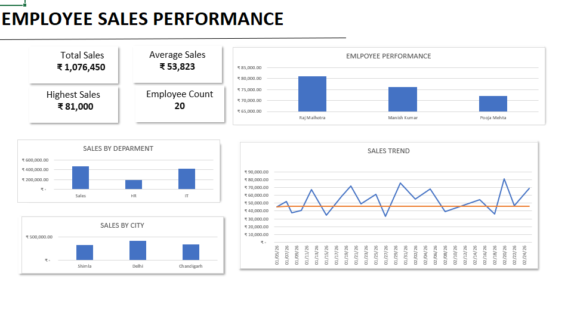

# Employee Sales Performance Analysis

An Excel data analysis project focused on analyzing employee sales performance using data cleaning, analysis, and dashboard creation.

## 📌 Project Overview

This project demonstrates an end-to-end data analysis workflow in Microsoft Excel:

**Raw Data → Data Cleaning → Analysis → Dashboard**

The dataset contains employee information including department, city, sales, date, and rating.

## 🎯 Project Objectives

- Clean and standardize raw employee data
- Identify and remove duplicate records
- Handle missing values
- Analyze sales performance
- Compare sales across departments and cities
- Identify top-performing employees
- Create a dashboard to visualize the results

## 🧹 Data Cleaning

The following cleaning tasks were performed:

- Removed extra spaces using `TRIM()`
- Standardized names using `PROPER()`
- Standardized department and city names
- Removed duplicate employee records
- Handled missing sales data
- Verified the cleaned dataset before analysis

## 📊 Analysis

The analysis included:

- Total Sales
- Average Sales
- Highest Sales
- Lowest Sales
- Employee Count
- Average Rating
- Sales by Department
- Sales by City
- Top 3 Employees by Sales
- Sales Trend

## 📈 Dashboard

The final Excel dashboard contains:

- KPI cards
- Employee performance chart
- Sales by department
- Sales by city
- Sales trend

## 🛠️ Tools & Skills

- Microsoft Excel
- Data Cleaning
- Excel Formulas
- Data Analysis
- Data Visualization
- Dashboard Creation

### Excel Functions Used

`TRIM()` · `PROPER()` · `SUM()` · `AVERAGE()` · `MAX()` · `MIN()` · `COUNTA()` · `SUMIF()` · `LARGE()` · `XLOOKUP()`

## 💡 Key Findings

- Raj Malhotra recorded the highest individual sales at ₹81,000.
- Manish Kumar recorded ₹76,000 in sales.
- Pooja Mehta recorded ₹72,000 in sales.
- Total sales across the 20 employees were ₹10,75,789.47.
- Average sales per employee were ₹53,789.47.
- Sales performance was compared across Sales, HR, and IT departments.
- Sales performance was also analyzed across Shimla, Delhi, and Chandigarh.

## 📁 Project Files

- `Employee_Sales_Performance_Analysis.xlsx` — Complete Excel project
- `dashboard.png` — Final dashboard
- `analysis.png` — Analysis sheet

## 📚 Learning Outcome

This project helped me practice the complete process of transforming raw data into cleaned information, analyzing it using Excel, and presenting the results through a dashboard.
